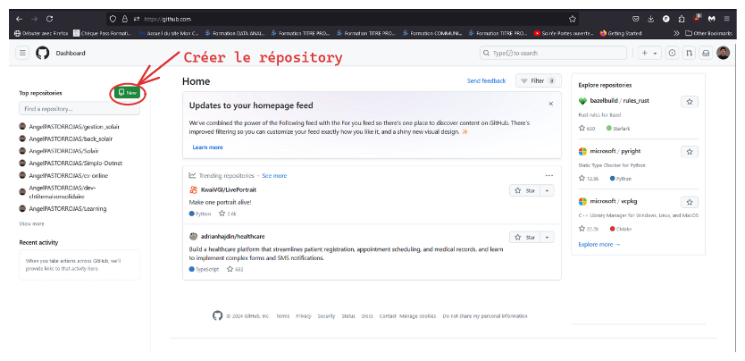
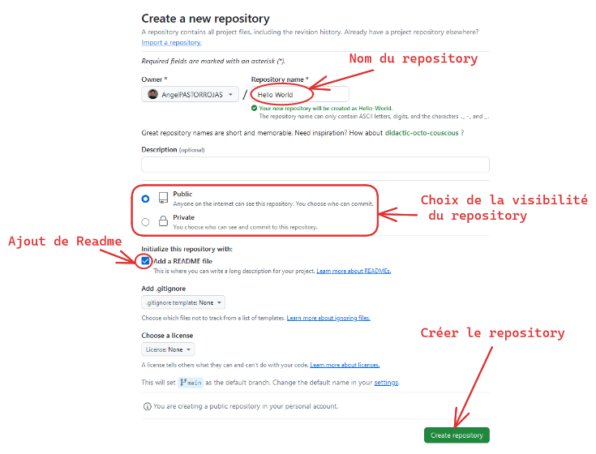
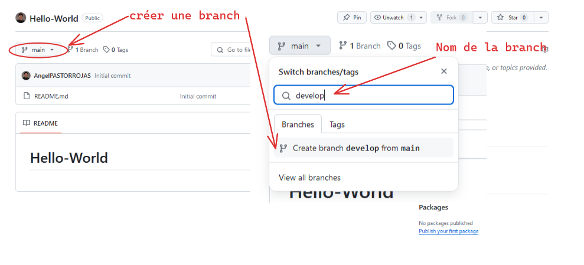
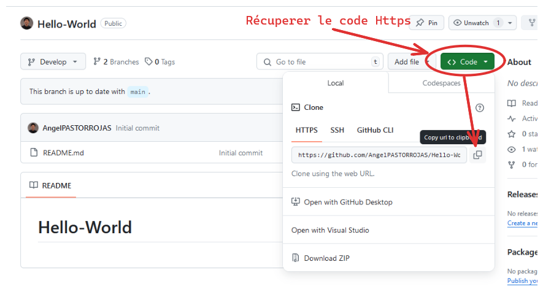
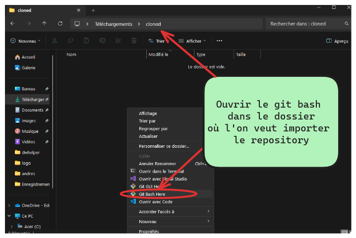
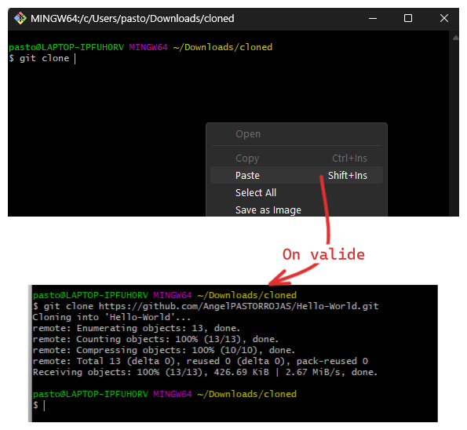

# Tuto Git

- [x] Creer un compte GitHub (optionnel)
    https://docs.github.com/fr/get-started/start-your-journey/creating-an-account-on-github

- [x] Creer un Repository "Hello World!"
  ## Step 1
  
  ## Step 2
  
- [x] Creer une branch Develop
  
- [x] Cloner la branch en utilisant la clé Https en local (GitBash)
  
  
  
- [x] Editer le README.md
- [x] Pusher le README (ou tout le dossier) sur GitHub
```bash
git add .
git commit -m "modification du Readme"
git fetch
```
- [ ] Merger la branch Develop sur la Branch Main
